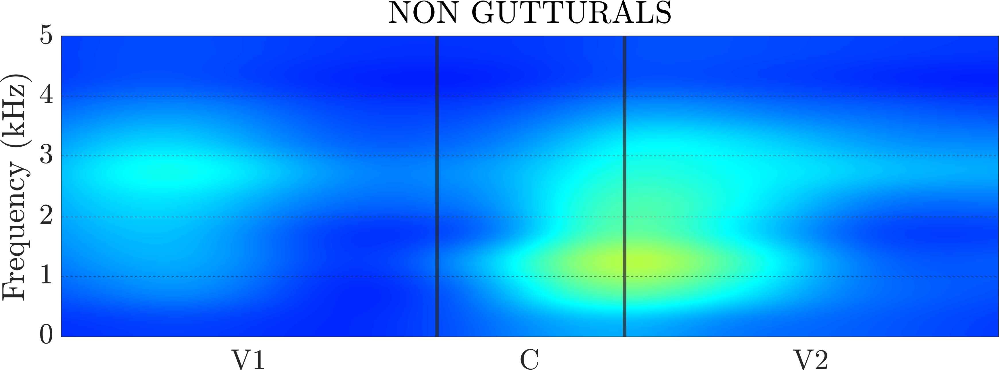
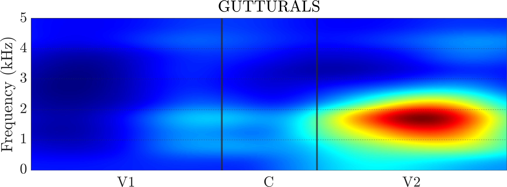
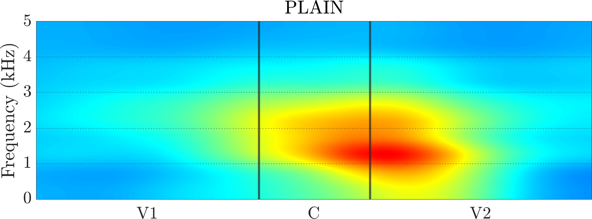
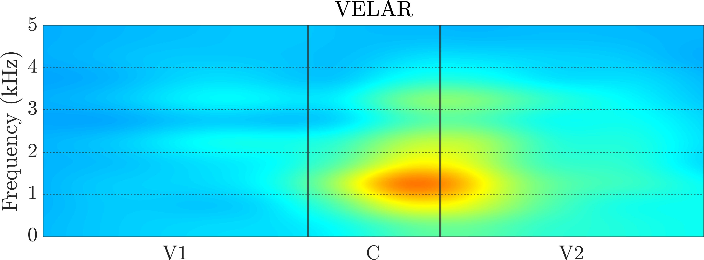
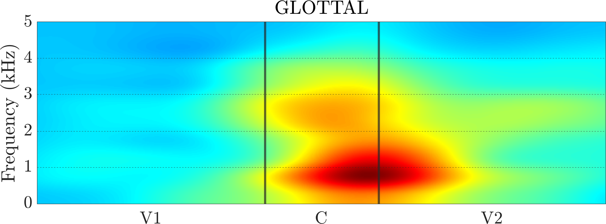
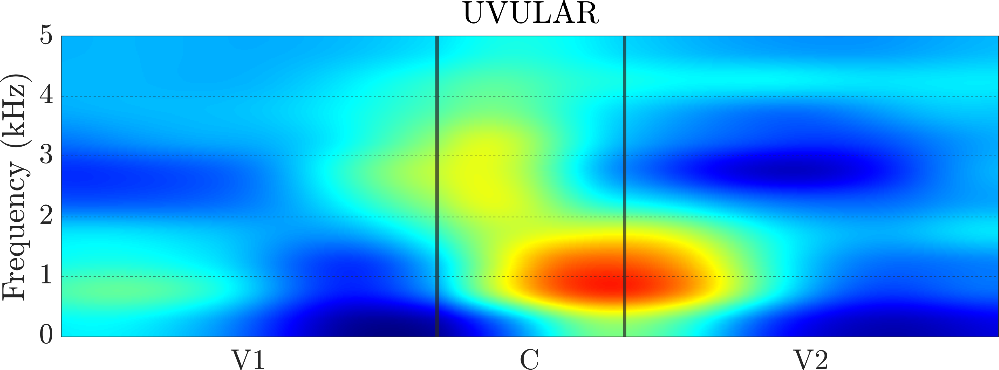
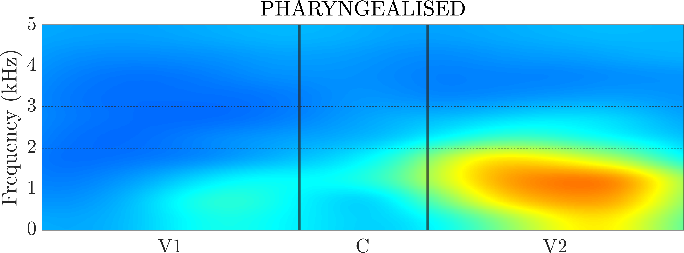
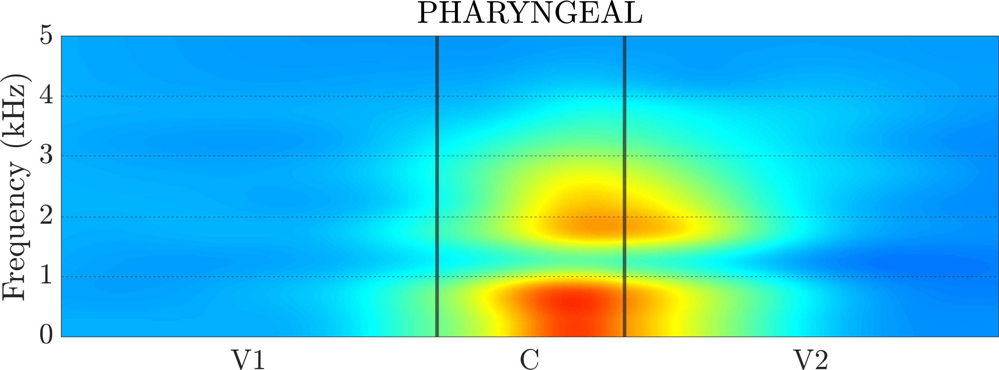

+++
title = "The phonetic basis of the guttural natural class in Levantine Arabic: Evidence from coarticulation and energy components using Deep Learning and Random Forests"
publishDate = 2020-06-12T00:00:00  # Schedule page publish date.
draft = false

# Talk start and end times.
#   End time can optionally be hidden by prefixing the line with `#`.
date = 2020-07-06T10:30:00
time_end = 2020-07-08T15:18:00

# Authors. Comma separated list, e.g. `["Bob Smith", "David Jones"]`.
authors = ["Jalal Al-Tamimi", "Emmanuel Ferragne"]

# Abstract and optional shortened version.
#abstract = ""
#abstract_short = ""

# Name of event and optional event URL.
event = "LabPhon 17"
event_url = "https://labphon.org/labphon17"

# Location of event.
location = "Vancouver"

# Is this a featured talk? (true/false)
featured = false

# Projects (optional).
#   Associate this talk with one or more of your projects.
#   Simply enter your project's folder or file name without extension.
#   E.g. `projects = ["deep-learning"]` references 
#   `content/project/deep-learning/index.md`.
#   Otherwise, set `projects = []`.
#projects = ["voxcrim"]
#projects = []

# Tags (optional).
#   Set `tags = []` for no tags, or use the form `tags = ["A Tag", "Another Tag"]` for one or more tags.
tags = ["Phonetics", "Research", "Deep Learning"]

# Slides (optional).
#   Associate this talk with Markdown slides.
#   Simply enter your slide deck's filename without extension.
#   E.g. `slides = "example-slides"` references 
#   `content/slides/example-slides.md`.
#   Otherwise, set `slides = ""`.
slides = ""

# Links (optional).
#url_pdf = "talk/ratics-6/R_atics_2019.pdf"
url_slides = ""
url_video = ""
url_code = ""

# Does the content use math formatting?
math = true

# Featured image
# To use, add an image named `featured.jpg/png` to your page's folder. 
[image]
  # Caption (optional)
  #caption = "Photo by Leo Wieling on Unsplash"

  # Focal point (optional)
  # Options: Smart, Center, TopLeft, Top, TopRight, Left, Right, BottomLeft, Bottom, BottomRight
  #focal_point = "Bottom"
+++

