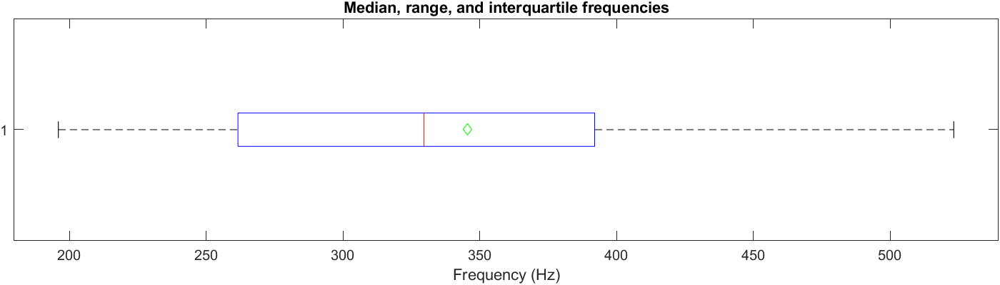

+++
title = "Because I got high #3"
subtitle = "The 440 Hz tuning standard and the human voice"
math = true

publishDate = 2021-01-08T00:00:00
lastmod = 2021-01-08T00:00:00
draft = false

# Authors. Comma separated list, e.g. `["Bob Smith", "David Jones"]`.
authors = ["Admin"]

tags = ["Phonetics", "Music"]
summary = "The 440 Hz tuning standard and the human voice"
[image]
  # Caption (optional)
  #caption = "Photo by Vlah Dumitru on Unsplash"

  # Focal point (optional)
  # Options: Smart, Center, TopLeft, Top, TopRight, Left, Right, BottomLeft, Bottom, BottomRight
  focal_point = "Top"

  # Show image only in page previews?
  preview_only = false

+++
In a rare interview in French[^1], the **legendary Italian operatic tenor Mario Del Monaco** complained that the tendency for orchestras to choose an increasingly higher reference pitch was one of the main problems in opera. This is a **recurring controversy** in the history of opera: opera houses throughout Europe used to have **different preferred tuning conventions** (and some still do), and, to cut a long story short, while orchestras often tended to choose a higher pitch in order to sound "brighter", singers understandably requested a lower tuning[^2]. 

# Basic physics

In this post I want to illustrate the effect of tuning to a higher reference pitch with a **practical example**. Let's start by checking Del Monaco's claim that going from 438 Hz to 450 Hz raises the pitch by almost a semitone: 

$12 \times \log  (\frac{450}{438}) / \log (2) = 0.4679$ semitones

This means that if the A above middle C, A4, is first tuned to 438, and then to 450 Hz, the difference between the two pitches will be about __half a semitone__ (i.e. half a half step). And as far as phonation is concerned, the vocal folds will open and close 438 and 450 times per second respectively; a difference of 12 Hz. Now, given the __logarithmic relationship between objective frequency and pitch__, maintaining this 0.5 semitone difference will require increasingly higher frequency differences as we go from A4 to higher notes. 

Let's take a simple example. Every doubling of frequency results in a note that is an octave higher. So, A5, in the soprano range, would be equal to 876 Hz (if A4 = 438 Hz) and 900 Hz (if A4 = 450 Hz). In other words, logically, __the same musical interval an octave higher implies that the difference between the two frequencies should be twice as big__: 24 Hz. 

# A fully worked example

There's a famous tenor aria in __Verdi's *Trovatore*__ known as Manrico's cabaletta or *Di quella pira*. First I'll try and __quantify the tessitura__ required for this aria, and then I'll assess how much additional strain to the tenor's voice a different tuning convention would cause. And let's assume that all else (tempo, volume, etc.) being equal, the total __number of vocal fold cycles in a given aria is an acceptable proxy for vocal demand__.

## Standard 440 Hz tuning

I installed [Musescore](https://musescore.org/en), a free program for music notation, and downloaded the free sheet music [here](https://musescore.com/user/56747/scores/1860776). 

I quickly edited[^3] the score so as to make it very roughly sound like a version I had in mind: [this encore](https://youtu.be/e0Lw-JRFrk8?t=5542) with Franco Bonisolli in Verona in 1985. And then the file was exported to the uncompressed musicxml format; it can be downloaded by right-clicking [this link](Di_quella_pira.musicxml). Being uncompressed, this file can be opened with a simple text editor, a browser, or Musescore if you want to visualize the score and play it with MIDI. 

I analyzed the file with [Tessa](https://github.com/Allerseelen/Tessa)[^4], which is a Matlab app. If you don't have Matlab you can install the standalone Tessa.exe program. Follow the various steps described on the Github page very carefully. When prompted to provide a __"part ID" and a tempo:__ P1, is the tenor track; and 115 BPM sounded fine to me. 

The output contains a number of graphs. For example, the first one is a __boxplot that summarizes pitch variation__. It shows that the pitch ranges from slightly below 200 Hz to somewhere beyond 500 Hz (that's the unwritten, yet traditional, high Cs at 523.25 Hz). The median pitch is around 330 Hz (red line) and the mean pitch around 345 Hz (green diamond).

The next plot is a histogram showing the __time spent singing each frequency__: over 13 secs were devoted to a note around 330 Hz, an E4. The two high Cs (righmost bar) add up to almost 10 secs. 

And then there's a curve showing __pitch variation over time__:  

More plots are available but they would reveal their full potential if I wanted to compare several songs/arias. Here, with just one aria, we can make do with numbers only. __Summary statistics can be found in the rightmost tab of Tessa__. Among other things, it shows that the tenor sings 52% of the time for a total of 24,030 vocal fold cycles. The total duration of this aria (with a tempo of 115 BPM) is 134 seconds, so the average number of vocal fold cycles per second (over the whole cabaletta) is $24 030 / 134 \approx 179$, which is a __rough index of vocal demand__. 

## Shifting to A4 = 438 Hz and A4 = 450 Hz

Shifting the reference A4 frequency from 440 Hz to 438 Hz amounts to downtuning the orchestra by $12 \times \log  (\frac{440}{438}) / \log (2) \approx 0.0789$ semitones (i.e. 7.89 cents). An intuitive way to go about computing this is to remember that __the difference between two notes is a ratio between their frequencies__. In other words, e.g. $ \frac{438}{440} = \frac{876}{880} = \frac{1752}{1760} \approx 0.9954 $ . This is the same musical interval (7.89 cents) at three different octaves: the ratio is constant while the difference between the two frequencies doubles as we move to higher octaves. 
We can now use the "full_pitch" table that Tessa created after parsing the original XML file to compute our downtuned version of *Di quella pira*. 

Looking at the first row, we can see that the first syllable, "Di", is an E4 whose frequency, according to the standard 440 Hz tuning, is 329.6275 Hz. We know from the previous paragraph that the conversion to our new 438 Hz standard implies that the original notes be multiplied by $ \frac{438}{440} \approx 0.9954 $. So our new E4 has a frequency of $329.6275 \times 0.9954 = 328.1112$ Hz. 

This new value is then multiplied by the duration of the note, 0.5217 secs, to compute the __new number of vocal fold (VF) cycles for this note__: 171.1756 (vs the original 171.9796). And if we did this for all notes, we'd end up with a new, lower, number of VF cycles for the whole aria tuned to A4 = 438 Hz. But there's an even more intuitive method: my old __record player when I was a kid had a button that controled rotation speed. This button was quite appropriately labelled "pitch"__. If you increased rotation speed, the whole song would sound higher and faster, and the opposite would happen if motor speed was slowed down. Here we want something similar except that duration should be preserved. So we can multiply the total number of VF cycles by the ratio of new to old reference frequency: 

- $24030  \times \frac{438}{440} \approx 23921$ VF cycles for the 438 Hz standard 
- $24030  \times \frac{450}{440} \approx 24676$ VF cycles for the 450 Hz standard

In other words, going from a 438 to a 450 Hz tuning would imply that the tenor's vocal folds would open and close $24676 - 23921 = 755$ more times.

__In this post, my aim was to quickly show how the Tessa program could be used to quantify the variation in vocal strain induced by different tuning standards. Whether the extra 755 vocal fold cycles here constitute a reliable estimate of the extra cost for the singer, and how this figure should be interpreted, I have no clear answer. It obviously depends on where in a singer's range these additional vibrations occur. No matter how impressive his voice was, Mario Del Monaco did not have a reliable high C even in his prime[^5]; so slightly higher pitches at the top of his range would have been a problem.__ 

[^1]: The whole interview is very interesting but the pitch problem is addressed [here](https://youtu.be/GG9DT-nOgig?t=539). 
[^2]: More on this in the Wikipedia article on [concert pitch] (https://en.wikipedia.org/wiki/Concert_pitch). 
[^3]: I must insist: this is a very, very rough edit just for this demo's sake. 
[^4]: Apfelbach, C. S. (2020). Tessa: A Novel MATLAB Program for Automated Tessitura Analysis. Journal of Voice, S0892199720302903. https://doi.org/10.1016/j.jvoice.2020.07.039
[^5]: Ségond, A., & Sébille, D. (1981). *Mario Del Moncaco ou un ténor de légende*. Laffont. Lyon. 

