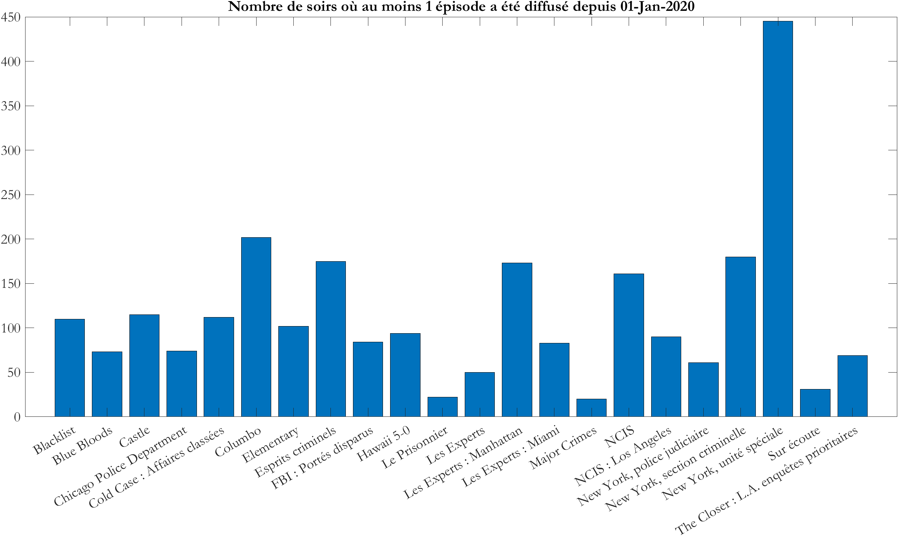

+++
title = "About crime dramas on French TV"
subtitle = "Browsing TV listings automatically"
math = true

publishDate = 2022-02-27T00:00:00
lastmod = 2022-02-27T00:00:00
draft = false


# Authors. Comma separated list, e.g. `["Bob Smith", "David Jones"]`.
authors = ["Admin"]

tags = ["Research", "Forensic", "Voice", "Phonetics"]
summary = "Browsing TV listings automatically"
[image]
  # Caption (optional)
  #caption = "Photo by Vlah Dumitru on Unsplash"

  # Focal point (optional)
  # Options: Smart, Center, TopLeft, Top, TopRight, Left, Right, BottomLeft, Bottom, BottomRight
  focal_point = "Top"

  # Show image only in page previews?
  preview_only = false

+++

In a recent talk at __Service National de Police Scientifique__, someone suggested to me that young adults might not be familiar with the type of TV shows (*CSI, Law and order*, etc.) we're working on in the [VoCSI-Telly](/project/vocsitelly) project. 

I was quite confident that such series were __still widely available on French TV__. 

Of course, TV viewing habits vary from one generation to the next. But if we assume that some of the young adults in question still exhibit the kind of 'lazy' __channel-surfing behaviour that is typical of my generation__, they will, I thought, sooner or later come across one of these series.

I was lucky enough to find a __website that stores old TV listings__ (from Jan., 1st 2020 onwards). And I wrote a short program that produced the following figure. It's still very coarse, but it shows that, for example, if you look at the tallest bar, *New York unité spéciale* (*Law and Order: Special Victims Unit*) appeared at least once about 450 times (out of the 790 prime time slots since Jan., 1st 2020). 



In fact, sometimes as many as 5 episodes of this version of *Law and Order* have been shown in a row. If you add up the hits from the 22 series shown in the figure, you get 2,500. Therefore, although my short program needs refining, all the __evidence points to the ubiquity of English-speaking crime shows on French TV__. Whether the 'young adults' in question still watch TV the way older adults do is, of course, a totally different question. Here's the Matlab program, by the way:

```matlab
tic %takes about 45 secs to run
dt = datetime(20200101, 'ConvertFrom', 'yyyymmdd');
dateVec = dt:1:date;
resultats = cell(length(dateVec), 28);
compteur = 1;
for idx = dateVec
    currentDate = datestr(idx, 'yyyy-mm-dd');
    myProg = webread(['https://programme-tv.nouvelobs.com/programme-tv/' currentDate '/']);
    nomSeries = {'Blacklist', 'Blue Bloods', 'Castle', 'Chicago Police Department',...
        'Cold Case : Affaires classées', 'Columbo', 'Elementary', 'Esprits criminels',...
        'FBI : Portés disparus', 'Hawaii 5-0', 'Hawaï police d''Etat', 'Le Prisonnier<',...
        'Les Experts<', 'Les Experts : Manhattan', 'Les Experts : Miami', 'Lie to Me',...
        'Major Crimes', 'NCIS<', 'NCIS : Los Angeles', 'New York, police judiciaire',...
        'New York, section criminelle', 'New York, unité spéciale', 'Numb3rs', 'Person of Interest',...
        'Rizzoli and Isles', 'Sur écoute<', 'The Closer : L.A. enquêtes prioritaires',...
        'X-Files : Aux frontières du réel'};
resultats(compteur, :) = regexpi(myProg, nomSeries);
compteur = compteur + 1;
end
toc
nonVides = cellfun(@(x) ~isempty(x), resultats);
totalSeries = sum(nonVides,1);
newTab = table(nomSeries(logical(totalSeries))', totalSeries(logical(totalSeries))');
newTab.Properties.VariableNames = {'series', 'nombre_match'};
newTab.series = replace(newTab.series, '<', '');
bar(newTab.nombre_match)
set(gca, 'XTickLabel', newTab.series, 'XTick', 1:length(newTab.series))
title(['Nombre de soirs où au moins 1 épisode a été diffusé depuis ' datestr(dateVec(1))], 'FontName', 'Garamond',...
    'FontSize',24);
set(gca, 'FontName', 'Garamond', 'FontSize', 18)
```