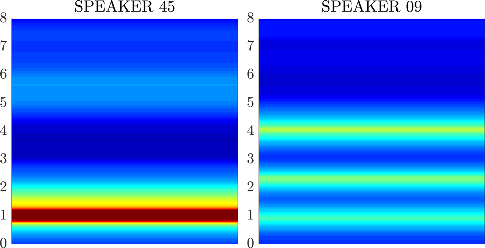

+++
title = "Here in my deep purple dreams"
subtitle = "On the deep learning approach to phonetics: black boxes?"

date = 2019-07-22T00:00:00
lastmod = 2019-07-22T00:00:00
draft = false

# Authors. Comma separated list, e.g. `["Bob Smith", "David Jones"]`.
authors = ["Admin"]

tags = ["Deep Learning"]
summary = "On the deep learning approach to phonetics: black boxes?"
[image]
  # Caption (optional)
  #caption = "Photo by Vlah Dumitru on Unsplash"

  # Focal point (optional)
  # Options: Smart, Center, TopLeft, Top, TopRight, Left, Right, BottomLeft, Bottom, BottomRight
  focal_point = ""

  # Show image only in page previews?
  preview_only = false

+++

I've had a number of discussions with colleagues about what I call the **deep learning approach to phonetics**. It seems that no matter how carefully I think I introduce my views (e.g. in a recent invited talk, various conference papers, and even a grant application), some **misconceptions** remain as to what I'm trying to achieve and, more generally, regarding the use of artificial neural networks. Let me set the record straight.

## The deep learning approach to phonetics

I've already explained [here](../../talk/pac2019/) how I think phonetics (as well as any research field relying on quantitative data) will experience profound changes thanks to deep learning. I've also published a [short post](../neural-style-transfer/) on neural style transfer that, incidentally, illustrates how traditionally non quantitative fields can benefit from the use deep learning. Today, I'd like to address the widely held belief that artificial neural networks are ''black boxes''.

## 'Black-boxism'

In the 1990s and 2000s, artificial neural networks (ANNs) were often - and rightly - called ''**black boxes**''. Since the advent of deep learning (late 2000s, early 2010s), much effort has been put into explaining how ANNs **make their decisions**, especially through visual representations. In a [recent conference paper](../../publication/icphs-01), my colleagues and I presented a method to **highlight certain regions in a spectrogram** that might be typical of a speaker's voice. The resulting images (see below) show frequency bands (in red) that are important to distinguish the voice in question from other voices in the dataset. 

In [another paper] (../../talk/interspeech-19), we used **class activation maps**, which led us to find out that our model sometimes made good decisions for bad reasons. This analysis quite unexpectedly helped us to identify a confounding factor. 

Over the last few years, many papers in deep learning have addressed the interpretability issue and proposed efficient visualizations for a better grasp of the inner workings of ANNs. We have come to a point where I don't think ANNs should be called 'black boxes' any longer. From my own experience with a number of quantitative methods, I don't think deep neural networks are more opaque or misleading (far from it) than, for example, our standard use of statistical inference in science... the **flawed logic** behind null hypothesis testing has received a lot of criticism in the literature that (quite surprisingly) has remained largely ignored... 