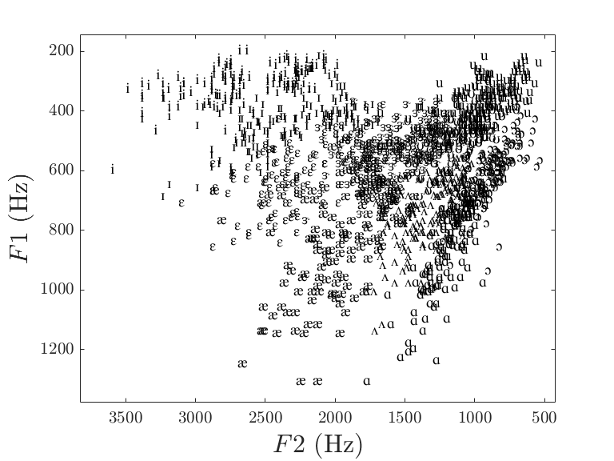
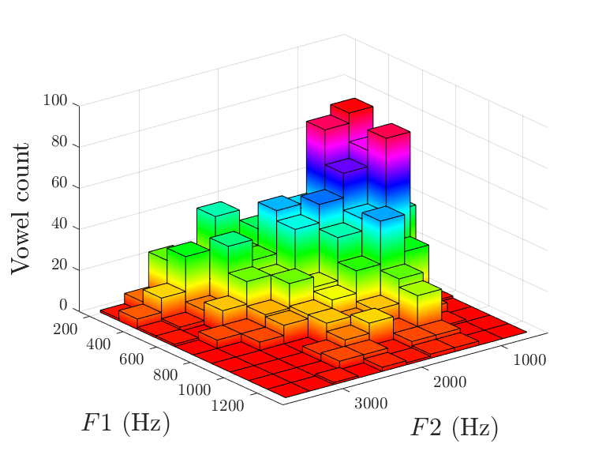
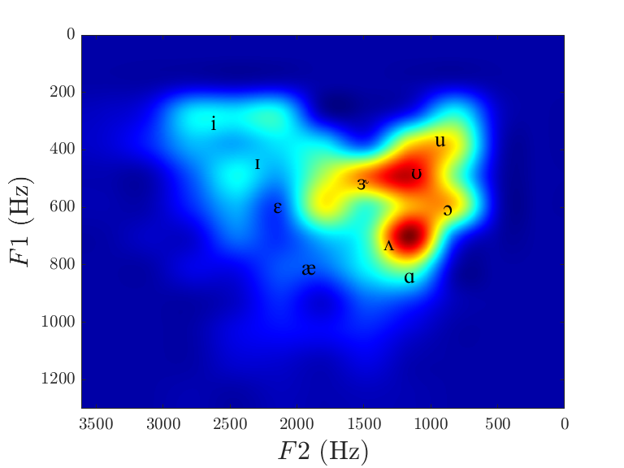
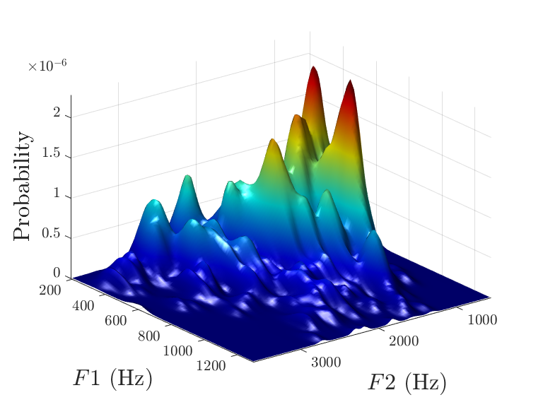

+++
title = "ET VOYLA !"
subtitle = "Software to visualize vowels (Windows 10)."

date = 2019-11-14T00:00:00
lastmod = 2019-11-14T00:00:00
draft = false

# Authors. Comma separated list, e.g. `["Bob Smith", "David Jones"]`.
authors = ["Admin"]

tags = ["Phonetics", "Software", "Research"]
summary = "Software to visualize vowels (Windows 10)."
[image]
  # Caption (optional)
  #caption = "Photo by David von Diemar on Unsplash"

  # Focal point (optional)
  # Options: Smart, Center, TopLeft, Top, TopRight, Left, Right, BottomLeft, Bottom, BottomRight
  focal_point = "Center"

  # Show image only in page previews?
  preview_only = false

+++

Over the last 20 years, I've written hundreds of short computer programs to perform certain tasks with my data or demos in class. Most of them have been used once or twice and will sleep forever on some forgotten hard drive. I thought perhaps this program might be worth resurrecting. **It takes a table with vowel formants as input and produces images of the vowel space.** 

Of course, if you do acoustic phonetics on a daily basis, you will be better off using software that allows more customizable displays (R, Python, Matlab, etc.). But for a quick demo in class, or a quick check of your data, maybe this program can help. 

The figures below show what **ET VOYLA !** can do for the moment (among other things) when you load the demo table I uploaded to the Github repo (that's the well-know dataset for Peterson & Barney's 1952 study). It used to be (and will be) able to do more things. 

You can download the [installer here](https://github.com/emmanuelferragne/ETVOYLA). Go to the Releases tab and download the latest version of ETVOYLA_installer.exe. This is a Matlab standalone program (compatible with Windows 10 only): installation and start-up are particularly slow... so please be patient. 

  