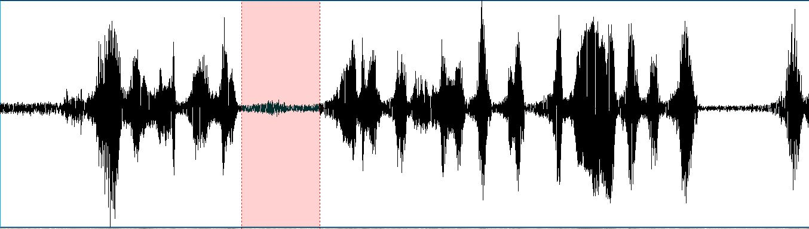

+++
title = "Fanfan la Tulipe"
subtitle = "A note on reversed speech"

publishDate = 2021-01-08T00:00:00
lastmod = 2021-01-08T00:00:00
draft = false

# Authors. Comma separated list, e.g. `["Bob Smith", "David Jones"]`.
authors = ["Admin"]

tags = ["Phonetics"]
summary = "A note on reversed speech"
[image]
  # Caption (optional)
  #caption = "Photo by Vlah Dumitru on Unsplash"

  # Focal point (optional)
  # Options: Smart, Center, TopLeft, Top, TopRight, Left, Right, BottomLeft, Bottom, BottomRight
  focal_point = "Center"

  # Show image only in page previews?
  preview_only = false

+++
At one point in the classic 1952 French film **Fanfan la Tulipe**, German officers led by Maréchal de Brandebourg discuss how they should adapt to the French's unorthodox ("reversed") attack. But they don't speak German. Instead, the audio has an amplitude envelope that is typical of **reversed speech**: while chunks of normal speech show fast increases followed by slow decreases in volume, once reversed, the opposite pattern appears. This is what causes the distinctive "aspirated" sensation which is reminiscent of the slow attack of a bowed string instrument (e.g. cello). 

**Reversed speech is unintelligible** (although we have shown that people can "hear" phonemes[^1]); hence its frequent use as a non-speech control condition in experiments on speech perception. So no matter how hard viewers may try to understand what Brandebourg says, they will probably fail; and before I was able to edit the audio, I wasn't even sure if this really was reversed speech and what the original language was. But without further ado, **here's the audio from the film**:

 <audio controls>
  <source src="extrait03.mp3" type="audio/mp3">
</audio> 

And this is the recovered **original audio played forward**. Note the old-fashioned theatrical diction (the actor, Lucien Gallamand, was born in 1888) that we no longer hear in movies these days:

 <audio controls>
  <source src="extrait03rev.mp3" type="audio/mp3">
</audio> 
*"This is inconceivable! No preparation for the battle, no artillery deployment! I don't understand what crossed the French general staff's mind. We have to move in what would have been the backward direction if the attack had been correct! And shut the windows!*

I was expecting something more exciting given that **backmasking** - that's the technical term for this effect - has often been (or thought to have been) used to hide **controversial/subliminal** messages. A well-known example is the alleged Satanic message hidden in [Led Zeppelin's song Stairway to Heaven](https://en.wikipedia.org/wiki/Stairway_to_Heaven#Claims_of_backmasking). This is probably nothing more than **pareidolia**: our tendency to interpret unknown or random audio/visual stimuli as patterns that are known to us. Typical illustrations include our ability to see animals in clouds or the [Mondegreen phenomenon] (https://en.wikipedia.org/wiki/Mondegreen) (misheard lyrics). 

**So why did they use reversed speech in Fanfan la Tulipe?** Was it meant to echo the "reversed" attack by the French in an attempt to make the whole situation more funny? In which case we may wonder to what extent viewers in 1952 were able to recognize this effect... In any case, it can't have been an attempt to sound German; for obvious reasons, French viewers in 1952 were familiar with the German language. 

I'd like to conclude with a **short technical note**. Looking at the signal before I reversed it; I saw "silences", like the pink area in the following figure, and I took it for granted that each signal chunk delimited by such silences should be reversed independently. 

The alternative option would have been to reverse the whole passage. This solution is (at least semantically) equally plausible:
 <audio controls>
  <source src="extrait03revWhole.mp3" type="audio/mp3">
</audio> 

[^1]: [Pellegrino, F., Ferragne, E., & Meunier, F. (2010). 2010, a speech oddity: Phonetic transcription of reversed speech. Interspeech, Sep. 2010, Makuhari, Japan. Pages : 1221-1224](https://hal.archives-ouvertes.fr/hal-01121562/document)

