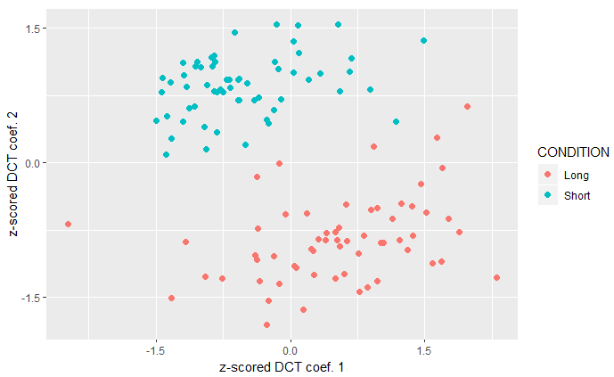

+++
title = "Formant dynamics analysis: a worked example"
subtitle = "Tutorial"

date = 2020-09-25T00:00:00
lastmod = 2020-09-25T00:00:00
draft = false

# Authors. Comma separated list, e.g. `["Bob Smith", "David Jones"]`.
authors = ["Admin"]

tags = ["Phonetics", "Research"]
summary = "This is a quick tutorial showing one way to analyze formant dynamics"
[image]
  # Caption (optional)
  #caption = "Photo by Vlah Dumitru on Unsplash"

  # Focal point (optional)
  # Options: Smart, Center, TopLeft, Top, TopRight, Left, Right, BottomLeft, Bottom, BottomRight
  focal_point = ""

  # Show image only in page previews?
  preview_only = false

+++

The acoustic analysis of vowels, as far as monophthongs are concerned, has been based on a rather uncontroversial procedure for many decades: compute the centre frequency of the first formant (F1) e.g. at temporal midpoint, repeat the process for the second formant (F2), and then plot the vowels as single points in the F1/F2 plane. But a recurring question I get from students and colleagues is: **how do I analyze non monophthongs acoustically (i.e. formant dynamics)?**

This is slightly more complex for a number of scientific and technical reasons: formant contours come in different sizes, which is hard to handle in flat files (e.g. spreadsheets) and implies choices in terms of temporal alignment, time normalization or warping; coming up with a parsimonious set of parameters to describe a contour requires techniques that phonetics students may not be familiar with, etc. 

**Over the years, I've used different techniques like:**

- locating two 'targets' within a single vowel, and plotting two points, joined by a straight line, in the F1/F2 plane;
- fitting lines or curves (e.g. polynomial regression) to formant contours and using the coefficients in the equations as parameters for the analysis;
- computing the distance travelled in the F1/F2 plane. 

Today I'd like to show a **full worked example involving the discrete cosine transform with R software**. I'll focus on the practical aspects, leaving out the scientific rationale (see e.g. Elvin et al., 2016). And I'm providing the dataset: it consists of 360 vowels (12 speakers × 10 words × 3 repetitions) that were collected in Glasgow to study the effect of a morphologically-conditioned vowel alternation (stemming from the so-called *Scottish Vowel Length Rule* – see e.g. Ferragne, 2020) on formant trajectories. These vowels occur in minimal pairs like *tide-tied*; the heteromorphemic [d] in the second word causes the preceding vowel to lengthen and to display a different formant pattern from the monomorphemic item.

**Now moving on to the tutorial itself...**

Download the dataset [here](https://github.com/emmanuelferragne/dynamicFormantDataset), and open it in R (I use RStudio): File > Open file...
This creates a new variable in the workspace, called *dataList*.

Additional packages are required; you should install **dtt**, **ggplot2** and **reshape2** before doing anything else.
```R
#you can install them all at once
 install.packages(c("dtt", "ggplot2", "reshape2"))
```
Here's how you can access the data stored in the list:
```R
#show metadata for 3rd object in the list
dataList[[3]]$metadata
#show 3rd word
dataList[[3]]$metadata$word
#show F1 contour for the 3rd item
dataList[[3]]$data$F1Hz
#show F2 contour for the 5th item
dataList[[5]]$data$F2Hz
#etc...
```
Next we retrieve the list of speakers and words, and create a new factor with 2 levels: "L" if the vowel is long, and "S" if it's short: 
```R
#get list of words
wordList = unlist(lapply(dataList, function(x) x$metadata$word))
#get speaker list
speakerList = unlist(lapply(dataList, function(x) x$metadata$speaker))
#create new variable to distinguish short and long vowels
vowelType = matrix(nrow = length(wordList), ncol = 1)
vowelType[wordList %in% c("bide","pride","ride", "side", "tide")] = "S"
vowelType[!(wordList %in% c("bide","pride","ride", "side", "tide"))] = "L"
vowelType = as.factor(vowelType)
```
**Interpolation** is then performed so that, whatever its initial duration, a contour is now represented by 30 equally-spaced points. This is standard in the literature though to me, it's only partially valid... but that's another story...
```R
#perform cubic spline interpolation
mySpline.F1 = lapply(dataList, function(x) spline(x$data$F1Hz, n= 30))
mySpline.F2 = lapply(dataList, function(x) spline(x$data$F2Hz, n= 30))
```
And here the **DCT** is computed:
```R
#compute DCT coefficients
require(dtt)
myDct.F1 = lapply(mySpline.F1, function(x) dct(x$y))
myDct.F2 = lapply(mySpline.F2, function(x) dct(x$y))
#keep only first 3 coefficients
coef3.F1 = lapply(myDct.F1, function(x)  {x[4:length(x)]= 0; x})
coef3.F2 = lapply(myDct.F2, function(x)  {x[4:length(x)]= 0; x})
#compute inverse transform
inv.F1 = lapply(coef3.F1, function(x) dct(x, inverted = T))
inv.F2 = lapply(coef3.F2, function(x) dct(x, inverted = T))
#store coefficients to data frame (here only F1; but it works for F2 too)
coefMat.F1 = matrix(unlist(lapply(coef3.F1, function(x) {x[1:3]})), nrow = length(coef3.F1), byrow = T)
scatterData = data.frame(speakerList, wordList, vowelType, coefMat.F1)
colnames(scatterData) = c("speaker", "word", "length","c0", "c1", "c2")
#get mean of 3 word repetitions for each speakers
meanCoefs = aggregate(cbind(c0,c1,c2)~speaker + word + length, scatterData, mean)
```
Here the DCT **coefficients are z-scored**. You could skip this step; I tend to z-score most values related to vowel formants because their frequencies are partly speaker-dependent.  
```R
#scale coefs by speaker
sortedCoefs = meanCoefs[order(meanCoefs$speaker),]
mySpeakers = unique(meanCoefs$speaker)
scaledCoefs = data.frame(matrix(nrow = dim(meanCoefs)[1], ncol = dim(meanCoefs)[2]-3))
for (spk in 1:length(mySpeakers)){
  currentData = sortedCoefs[sortedCoefs$speaker == mySpeakers[spk],4:dim(meanCoefs)[2]]
  scaledCoefs[sortedCoefs$speaker == mySpeakers[spk],] = scale(currentData)
}
scaledCoefDf = data.frame(sortedCoefs$speaker, sortedCoefs$length, scaledCoefs)
colnames(scaledCoefDf) = c("speaker", "length", "c0", "c1", "c2")
levels(scaledCoefDf$length) = c("Long", "Short")
```
Final step: **plot** the results:
```R
#do scatterplot
require(ggplot2)
ggplot(scaledCoefDf, aes(c1, c2, col = length)) +
  geom_point(size = 2) + xlab("z-scored DCT coef. 1") +
  ylab("z-scored DCT coef. 2") + scale_y_continuous(breaks=seq(-1.5,1.5,1.5)) +
  scale_x_continuous(breaks=seq(-1.5,1.5,1.5)) + coord_fixed() +
  guides(color=guide_legend("CONDITION"))
```
You should get something like this:

As can be seen from the scatterplot, DCT coef 2 seems to be the relevant parameter here to tell long vowels from short ones. The next logical step (if you were to write a comprehensive research report, or an article) would be to carry out a stasticial test with DCT coef 2 as the dependent variable and Vowel Type (L vs S) as the (fixed) factor, optionally with Speaker and Word as random factors. 

And optionally, if you want to see what the **inverse DCT** (the smoothed version of the original curve reconstructed from the first 3 coefficients) looks like, here's my suggestion:
```R
require(reshape2)
smoothMat = matrix(unlist(inv.F1), nrow = length(coef3.F1), byrow = T)
smoothDF = data.frame(speakerList, wordList, vowelType, smoothMat)
colnames(smoothDF) = c("speaker", "word", "condition", 1:30)
#create grouping factor
groupFact = paste0(speakerList, wordList, vowelType)
smoothDF$grouping = groupFact
#compute mean curves per word per speaker
meanCurves = aggregate(.~speaker + word + condition + grouping, smoothDF, mean)
#do by-speaker data centering
mySpeakers = unique(meanCurves$speaker)
centeredData = data.frame(matrix(nrow = dim(meanCurves)[1], ncol = dim(meanCurves)[2]-4))
for (spk in 1:length(mySpeakers)){
  currentData = meanCurves[meanCurves$speaker == mySpeakers[spk],5:dim(meanCurves)[2]]
  currentMean = colMeans(currentData)[1]
  centeredData[meanCurves$speaker == mySpeakers[spk],] = currentData - currentMean
}
centerCurvDF = data.frame(meanCurves$speaker, meanCurves$word, meanCurves$condition, 
                          meanCurves$grouping, centeredData)
colnames(centerCurvDF) = c("speaker", "word", "condition", "grouping", 1:30)
levels(centerCurvDF$condition) = c("Long", "Short")
meltCenterDF = melt(centerCurvDF, variable.name = "timeStep")

ggplot(meltCenterDF, aes(timeStep, value, 
                         colour = condition, 
                         group = grouping)) + geom_line(size=.8) +
  xlab("Normalized time") +
  ylab("F1 (Hz - centered intercept)") +
  guides(color=guide_legend("CONDITION")) +
  scale_x_discrete(breaks = NULL)
```

__Quick edit (2022-07-15):__ 

I wrote this tutorial 2 years ago and the whole workflow is still working. However, I've just run into a minor issue today with the following error message: "'Rcpp_precious_remove' not provided by package 'Rcpp'"

I re-installed and loaded Rcpp explictly:
```R
install.packages('Rcpp')
library(Rcpp)
```
And everything worked nicely again!
If you have trouble reproducing my tutorial, please don't hesitate to [contact me](mailto:emmanuel.ferragne@u-paris.fr?subject=dynamic formant tutorial).

__End of edit__


Once you master the procedure, you'll be ready to apply it to your own data. The easiest way to have the right structure for you dataset is to perform your formant analysis following the workflow I describe [here](https://github.com/emmanuelferragne/CminR-Praatik). 


**REFERENCES**

Elvin, J., Williams, D., & Escudero, P. (2016). Dynamic acoustic properties of monophthongs and diphthongs in Western Sydney Australian English. *The Journal of the Acoustical Society of America*, 140(1), 576-581) 

Ferragne, E. (2020). The production and perception of derived phonological contrasts in selected varieties of English. In A. Przewozny, C. Viollain, & S. Navarro, *The Corpus Phonology of English: Multifocal Analyses of Variation* (p. 30-49). Edinburgh University Press.


