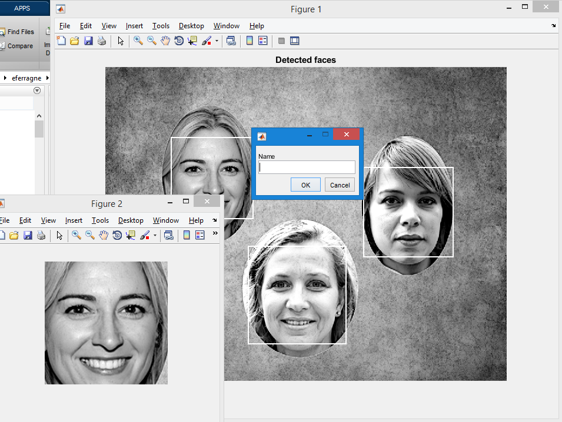

+++
title = "Genealogy meets computer vision"
subtitle = "How I interactively tag old family pictures."

publishDate = 2019-02-27T00:00:00
lastmod = 2019-02-27T00:00:00
draft = false

# Authors. Comma separated list, e.g. `["Bob Smith", "David Jones"]`.
authors = ["Admin"]

tags = ["Computer Vision"]
summary = "How I interactively tag old family pictures."

+++

I've always been into **family history**. Last year I asked my grandmother whether she could show me all the family pictures she had, and I painstakingly scanned most of the oldest ones. In order to integrate them smoothly to my genealogy workflow (yes, I have ''workflows'' for non-professional stuff too), I needed a quick way to **spot faces and tag them**. Now, I'm pretty sure existing software can do that for you, but I'm always inclined to try solutions with some amount of DIY effort. 


I wrote a small **Matlab script** that takes a picture as input, prompts the user to insert a tag when a face is automatically detected, and outputs an html file. Open the file in a web browser, and a person's name will pop up as soon as you hover over their face with the cursor. The automatic detection of faces here relies on the cascade object detector from Matlab's Computer Vision Toolbox. Of course I've included the possility to interactively reject false detections and also to draw bounding boxes manually to make up for possible misses.

# Step by step guide

Most steps are intuitive. A dialog box asks the user to choose a .png or .jpg picture file. Click ok. Then you should be able to see something similar to this picture, with Figure 1 showing bounding boxes around faces that have been detected, and all faces will appear successively in Figure 2 while the script waits for the user to provide the person's name. 



(By the way, the women on this picture have never existed; they were produced by a generative adversarial network [here](https://thispersondoesnotexist.com/)).

If the image in Figure 2 is not somebody's face, or if you don't want to enter a tag for this person right now, click Cancel. 

Once you've entered a tag, you'll be prompted to link some file: I have html files for the ''recurring characters'' from my family tree, but you can skip this step and the link will point to some default file (mine is called noRecord.html) and it contains this:
```html
<meta http-equiv="Content-Type" content="text/html; charset=utf-8" />
<font size="32">No record yet for this person !</font>
```

Once all automatically-detected faces have been interactively processed, manual annotation can be performed if needed: the whole picture moves to the foreground and the user can draw a rectangle, double-click to validate, and enter the person's name, etc. 

At the end of the whole process, the html file looks like this:

```html


<map name="myMap">
  <area shape="rect" coords="169,180,377,388" href="noRecord.html" title="PERSON01">
  <area shape="rect" coords="658,256,887,485" href="noRecord.html" title="PERSON02">
  <area shape="rect" coords="365,457,615,707" href="noRecord.html" title="PERSON03">
</map>
```

The first line of the html says where the picture is on the disk and specifies its size. Then a `map` tag is created with clickable areas: whenever you hover over a face, the tag you entered is displayed. Here, the `area` tag has **4 attributes** : 

- `shape`, with the value `rect` for rectangle
- `coords`, the coordinates of the rectangular shape
- `href`, a hyperlink to some other html file
- `title`, the text that is displayed when the cursor is placed on the area


Download the code [here] (https://github.com/emmanuelferragne/tagFaces). 
