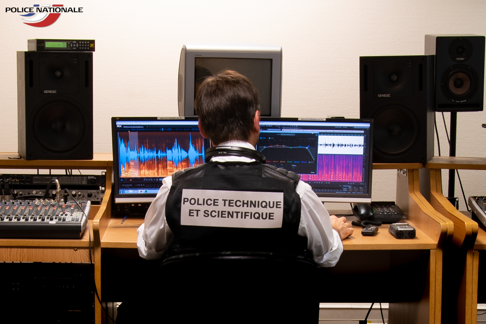
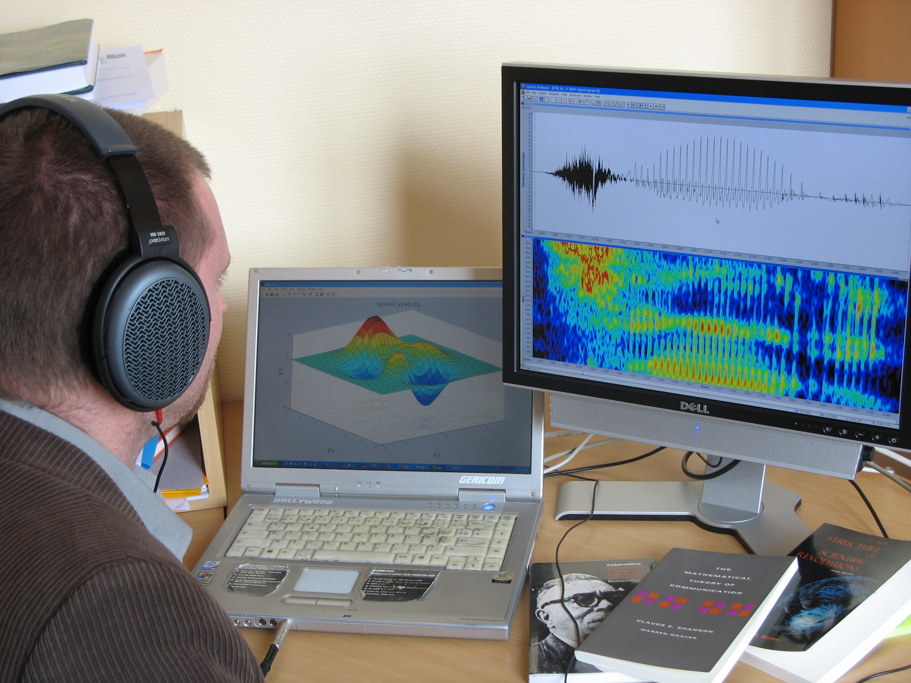

+++
title = "Spot the difference"
subtitle = "Don't blame it on the CSI effect; we too glamourize science!"

publishDate = 2021-01-08T00:00:00
lastmod = 2021-01-08T00:00:00
draft = false

# Authors. Comma separated list, e.g. `["Bob Smith", "David Jones"]`.
authors = ["Admin"]

tags = ["Forensic"]
summary = "Don't blame it on the CSI effect; we too glamourize science!"
[image]
  # Caption (optional)
  #caption = "Photo by Vlah Dumitru on Unsplash"

  # Focal point (optional)
  # Options: Smart, Center, TopLeft, Top, TopRight, Left, Right, BottomLeft, Bottom, BottomRight
  focal_point = ""

  # Show image only in page previews?
  preview_only = false

+++
*(version française [ici](#french-version))*

As I was browsing the web for updates on forensic voice comparison the other day, I came across the following picture (from [here](https://www.rtl.fr/actu/justice-faits-divers/police-scientifique-comment-les-voix-et-les-sons-sont-analyses-pour-resoudre-des-enquetes-7800912370)) and immediately recognized Christophe of the Police Scientifique: 

And I thought it would be fun, even before the [VoCSI-Telly](/project/vocsitelly) project officially starts, to play a little game of spot the difference... so I got in touch with Laurianne and Christophe to informally ask them which features on the photo were consistent with their working habits, and which were slightly exaggerated for the picture's sake. Of course, I had a number of expectations:

# The jacket
They confirmed they didn't wear this type of jacket (which is affectionately dubbed "filet de pêche": fishing net) when working at their desks. Note here that the jacket serves a specific purpose: the removable patch on the back tells viewers who's sitting here, very much as the back of a director's chair would. Could this be a hint to the potential fictionality of what is offered to the viewers? 

# Too much equipment
The room bristles with audio and video equipment; I found it fishy! But then I had second thoughts because I remembered I'd already seen this very room and, yes, it is indeed packed with hardware[^1]. So, this aspect is rather realistic, except that:

* The room is a collective working space; this is typically where the team meet to listen to recordings over speakers, or to work with interpreters; it's not their individual working desk. 

* As I suspected the two handheld recorders lying on the desk were very likely added to showcase the whole range of audio equipment available at the Police Scientifique. 

# Software

iZotope RX5 (left screen) and Adobe Audition (right screen) are two software programs used at the Police Scientifique to restore audio and enhance speech in noisy conditions. They offer attractive visualizations of the speech signal, with colourful spectrograms, and are therefore just the right candidates to appear on this kind of picture. One should bear in mind though that contrary to popular belief (reinforced by TV series), such displays are NOT used to assess how close two voices are. The latter is carried out with a whole different software package that only outputs numeric values; but admittedly, an Excel spreadsheet is not as photogenic as those flashy spectrograms[^3]...

__Now, are these "glamourized"/"optimized" pictures restricted to forensic scientists?__

# I plead guilty!

The following picture, featuring yours truly as a PhD student, was shot in the mid 2000s for my lab's website. Was this a faithful depiction of my daily routine? 

# Software

The laptop shows a 3D plot in Matlab entitled "vowel system". As it turns out, I simply took a random example from the software documentation and manually changed the title and axis labels. A 3D plot looks more attractive than the usual 2D vowel plot... 

The second screen shows the waveform and spectrogram of what seems to be an /hVd/ word (maybe _heed_). The program, Speech Analyzer, was chosen because you could display colour spectrograms. This is not consistent with how I used to work because 1) I never used Speech Analyzer for my PhD, and I was content with grayscale spectrograms, and 2) visually inspecting spectrograms is something I didn't do very often. 

# Hardware

This is the biggest fraud in the picture (but it's hard to detect): the screen on the right is connected to a desktop computer. I'm looking at this screen and apparently listening to the word that is displayed on it. However, if you watch carefully, the jack connector of the headphones is plugged into the laptop, i.e., the wrong computer... 

# Books

The 3 books are mine and I remember choosing them carefully for the picture; but the only one I've actually read from cover to cover (and several times too) is Kuhn's _The Structure of Scientific Revolution_. Wiener's _Cybernetics_ and Shannon and Weaver's _The Mathematical Theory of Communication_ are just here to beautify the mise en scène. 

# The jacket

Well, unfortunetaley, the outmoded jacket is genuine... I used to wear it even when I was working at my desk...

__These pictures illustrate our tendency to glamourize our daily routines as academics and forensic scientists in order to communicate more efficiently with the general public[^5]. The potential downside is that we may end up distorting people's perception of science, which, particularly in the case of forensics, can have adverse effects on justice. One of our goals in the [VoCSI-Telly](/project/vocsitelly) project is to track and analyze such instances of exaggerated science in TV series.__ 

[^1]: Actually they have a whole collection of legacy audio hardware next to this room. 
[^3]: Note however that this picture was not meant to illustrate voice comparison specifically. 
[^5]: Sometimes pressed by journalists. 

****

# French Version

Alors que j'explorais le web à la recherche d'informations récentes sur la comparaison de voix en criminalistique, je suis tombé sur la photo suivante ([source](https://www.rtl.fr/actu/justice-faits-divers/police-scientifique-comment-les-voix-et-les-sons-sont-analyses-pour-resoudre-des-enquetes-7800912370)), sur laquelle j'ai tout de suite reconnu Christophe, de la Police Scientifique :

J'ai trouvé que ce serait amusant, avant même le début officiel du projet [VoCSI-Telly](/project/vocsitelly), de se livrer à une sorte de jeu des 7 erreurs... j'ai donc contacté Laurianne et Christophe pour leur demander de manière informelle quelles caractéristiques de la photo reflétaient fidèlement leurs habitudes de travail, et quelles autres avaient été légèrement exagérées pour les besoins de la mise en scène. Bien sûr, j'avais quelques attentes précises :

# La veste
Il m'ont confirmé qu'ils ne portaient pas ce type de gilet (affectueusement surnommé "filet de pêche") quand ils sont au bureau. Ici le gilet joue un rôle spécifique : son dossard amovible dit au spectacteur qui est assis là, un peu à la manière d'un fauteuil de metteur en scène. De là à dire que c'est une façon de nous prévenir que certains éléments relèvent de la fiction... 

# Trop d'équipement

La pièce grouille d'équipement audio-visuel ; ça paraît suspect ! Mais en y réfléchissant, j'ai déjà vu cette pièce et l'équipement y est effectivement foisonnant[^2]. Cet aspect est donc bien réaliste, à ceci près que :

* Cette pièce est en réalité un espace de travail collectif : c'est là que l'équipe se réunit pour écouter des extraits via les haut parleurs, ou pour travailler avec des interprètes ; ce n'est donc pas leur espace de travail individuel. 

* Comme je le soupçonnais, les deux enregistreurs portables posés sur le bureau ont été ajoutés là pour afficher tout l'éventail de matériel audio disponible à la Police Scientifique. 

# Logiciels

iZotope RX5 (écran de gauche) et Adobe Audition (écran de droite) sont deux logiciels utilisés par la Police Scientifique pour restaurer l'audio et débruiter la parole. Ils offrent de bien belles représentations du signal de parole, avec des spectrogrammes colorés, et constituent donc les candidats idéaux pour ce genre d'image. Néanmoins, il faut garder à l'esprit que, contrairement aux idées reçues (renforcées par les séries policières), de telles représentations ne sont PAS utilisées pour estimer le degré de proximité entre deux voix. Cette tâche est confiée à un tout autre logiciel qui, lui, ne renvoie que des chiffres ; mais, j'en conviens, un tableau Excel n'est pas aussi photogénique que ces spectrogrammes chatoyants[^4]...

__Mais les collègues en criminalistique sont-ils les seuls à "glamouriser"/"optimiser" ce type d'image ?__

# Je plaide coupable !

La photo suivante, qui représente votre serviteur à l'époque de sa thèse, a été prise au milieu des années 2000 pour le site web de mon labo. Mon quotidien y est-il représenté fidèlement? 

# Logiciels

L'ordinateur portable montre un graphique en 3D réalisé avec Matlab intitulé "vowel sysem". En réalité, j'avais pris un exemple au hasard dans la documentation de ce logiciel et changé manuellement le titre et les étiquettes des axes. Un graphe en 3D est plus attrayant que l'espace vocalique habituel en 2D...

Le deuxième écran montre la forme d'onde et le spectrogramme de ce qui semble être un mot à structure /hVd/ (peut-être _heed_). J'avais choisi le logiciel Speech Analyzer parce qu'il permettait de faire des spectrogrammes en couleur. Mais ce n'est pas comme cela que je travaillais : 1) je n'ai jamais utilisé Speech Analyzer pour ma thèse et me suis contenté de spectrogrammes en noir et blanc, et 2) je n'ai que très rarement eu recours à l'analyse visuelle de spectrogrammes. 

# Matériel

Voici la plus grosse "arnaque" dans cette image (mais c'est quasiment indécelable) : l'écran de droite est connecté à un ordinateur fixe. Je suis apparemment en train de regarder cet écran et d'écouter le mot qui s'y trouve. Cependant, si on regarde attentivement, la prise jack de mon casque est en fait connectée à l'ordinateur portable ; le mauvais ordinateur, donc... 

# Les livres

Les 3 livres sont bel et bien à moi, et je me rappelle les avoir choisis avec soin pour la photo ; mais le seul que j'aie jamais lu entièrement (et plusieurs fois, d'ailleurs), c'est _The Structure of Scientific Revolution_ de Kuhn. _Cybernetics_ de Wiener, and _The Mathematical Theory of Communication_ de Shannon and Weaver relèvent de la mise en scène. 

# La veste

Malheureusement, la veste démodée est bel et bien authentique, et je la portais effectivement tout en travaillant... 

__Ces photos illustrent bien notre tendance, en tant que chercheurs ou scientifiques de la Police, à glamouriser notre quotidien afin d'optimiser notre communication auprès du grand public[^6]. Le revers de la médaille, c'est qu'on court le risque de distordre la perception de la science par le grand public au point où cela pourrait se révéler néfaste pour la justice. L'un des buts du projet [VoCSI-Telly](/project/vocsitelly) consite à repérer et analyser dans les séries télé ces  moments où la fiction embellit un peu trop la science.__ 

[^2]: Ils disposent en réalité de tout un arsenal d'équipement audio historique dans la pièce à côté. 
[^4]: À noter cependant que la photo n'a probablement pas été prise pour illustrer spécifiquement la comparaison de voix.
[^6]: Parfois sous la pression des journalistes.

