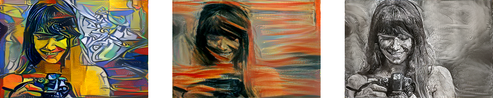

+++
title = "Neural style transfer"
subtitle = "AI art for everyone."

date = 2016-04-20T00:00:00
lastmod = 2018-01-13T00:00:00
draft = false

# Authors. Comma separated list, e.g. `["Bob Smith", "David Jones"]`.
authors = ["Admin"]

tags = ["Artificial Intelligence", "Deep Learning", "Art"]
summary = "Become an artist thanks to AI."

+++

I'm very enthusiastic about the deep learning technique known as **neural style transfer**. The image below shows, from left to right, a so-called content image, then another image whose style was extracted and applied to the content image to generate the righmost image. 

Now, this is the classic example in this area, featuring Van Gogh's *Starry Night*. As shown below, you can also for example ''Picasso-ize'', ''Munch-ize'', or ''Gustave Doré-ize'' your initial picture... the sky's the limit, really. 

I started listening to Heavy Metal music in the mid 1980s. Back then, people would buy cassette tapes or vinyl records and the artwork on the covers was of primary importance. Some bands from this era have a recognizable visual signature. Would it then be possible to e.g. ''Iron Maiden-ize'' our picture?

The style image for the 1st picture below was the cover artwork of the album [Killers](https://en.wikipedia.org/wiki/Killers_(Iron_Maiden_album)#/media/File:Iron_Maiden_Killers.jpg). The other two pictures were generated with the cover of [Piece Of Mind](https://en.wikipedia.org/wiki/Piece_of_Mind#/media/File:Iron_Maiden_-_Piece_Of_Mind.jpg). For the 3rd picture, the program was set to preserve the original colours of the content image. 

The algorithm did quite a good job capturing the essence of each cover artwork and applying the style to the image with the girl. But do these new pictures convey Iron Maiden's identity? Not really. For one thing: the only consistent ingredient in most of the band's artwork is not a particular colour or texture; it's their mascot: Eddie the Head.

Anyway, despite the advanced mathematical machinery under the hood, neural style transfer is a fun technique. Sometimes in Humanities departements in universities, people are either pro or anti-quantitative analyses. Because neural style transfer - and deep learning in general - learns **qualitative** representations from **quantitative** data, maybe the two parties will at last be tempted to work together?  

The code I used can be found [here] (https://github.com/cysmith/neural-style-tf). 

