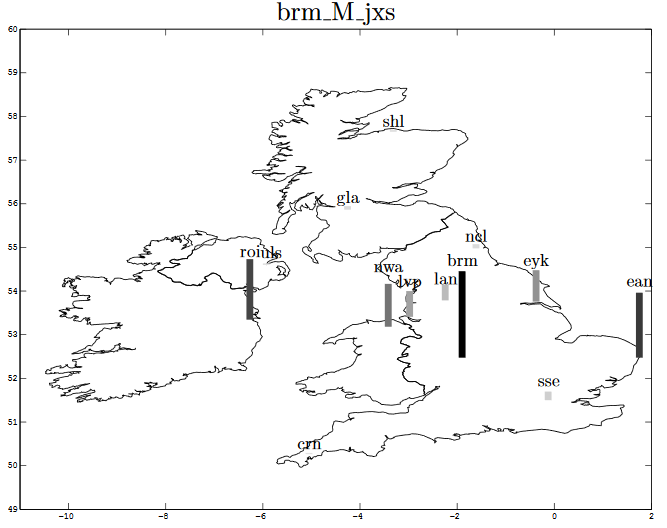
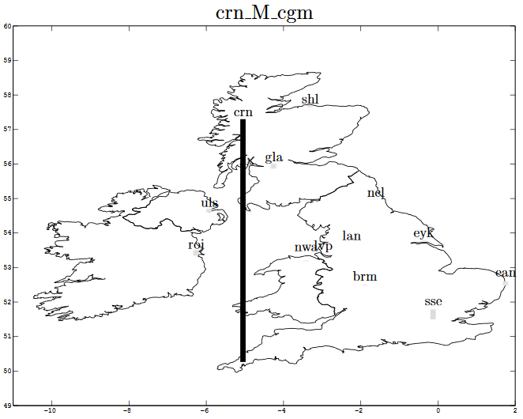
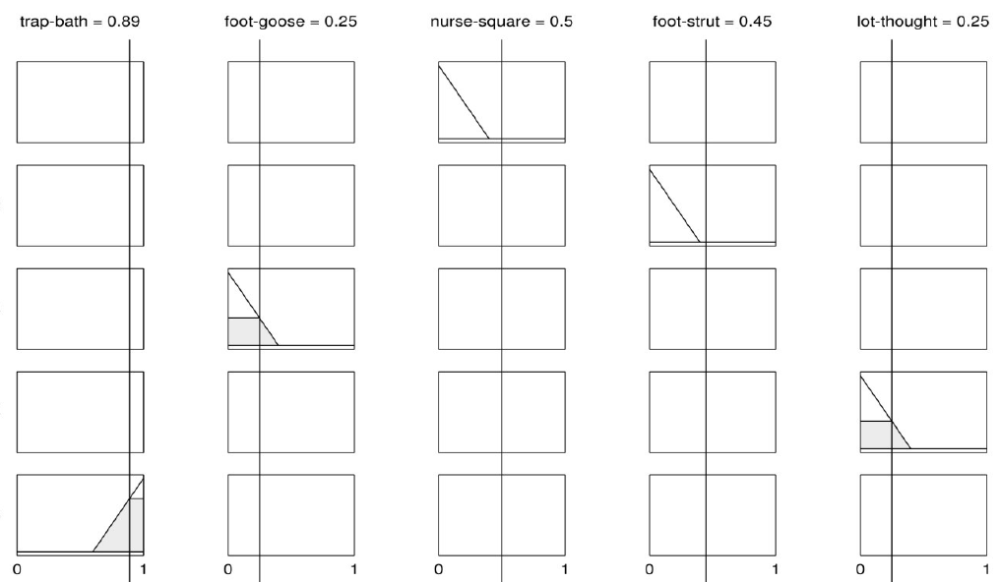
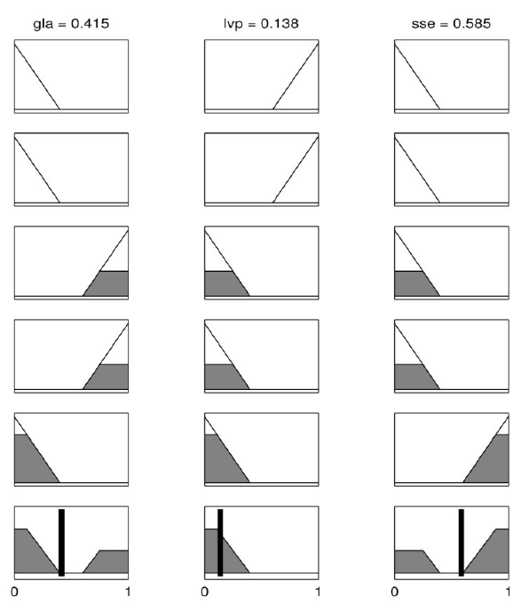

+++
title = "Ten years after"
subtitle = "Palatable leftovers from my PhD."

publishDate = 2019-06-10T00:00:00
lastmod = 2019-06-10T00:00:00
draft = false

# Authors. Comma separated list, e.g. `["Bob Smith", "David Jones"]`.
authors = ["Admin"]

tags = ["Phonetics"]
summary = "Palatable leftovers from my PhD."
[image]
  # Caption (optional)
  caption = "Photo by Kiwihug on Unsplash"

  # Focal point (optional)
  # Options: Smart, Center, TopLeft, Top, TopRight, Left, Right, BottomLeft, Bottom, BottomRight
  focal_point = ""

  # Show image only in page previews?
  preview_only = false
+++
I defended my PhD  *A phonetic study of modern dialects in the British Isles: towards automatic dialect identification* on June, 4th 2008. When I look at the manuscript now, there are:

1. things I wish I had done differently: another title, another corpus, more focus on phonological questions, etc.;
2. things I am not ashamed of after all these years: to my surprise, most of it has stood the test of time;
3. things I would have loved to explore further (and publish). I'll talk about a couple of examples that fall in the latter category in this post.

# Speaker stereotypicality
In accent groups, some speakers are more stereotypical than others. I devised a data-driven method to visualize to what extent a speaker was typical of a town/area. It was an acoustic measure of how much the speaker's vowel system was close to his/her group's mean vowel system and how close it was to that of other accents. The distance was based on correlations in the vowel space, which offered a kind of speaker normalization. And an S-shaped function was applied to this correlation in order for this metric to behave like membership functions used in fuzzy logic. In this figure, the speaker is not very typical of Birmingham because relatively high bars can be found in other locations; and this was supported by perceptual analysis. 

On the contrary, the following speaker from Cornwall was very typical (perceptually), and this is echoed by the tall bar on the following map, while other bars are extremely small:

At the end of the manuscript, there was a short discussion on the potential mismatch between a data-driven prototype, and the sort of prototype expert knowledge leads one to expect. Today, the issue is just as acute as it was then: what defines the ground truth? Is it because a speaker has been recorded in Birmingham that their recordings should be used to train an automatic model or should expert knowledge come to the rescue to reject atypical speakers? 

# A fuzzy expert system

In 2008, fuzzy expert systems were on the wane. But I thought it would be fun to build a rule-based system to guess somebody's accent. Vowels can be quite/rather/very/rather not similar/dissimilar: fuzzy set logic offers the possibility to model this sort of vagueness. I actually did not design a full system, just a subsets of preliminary rules. The figure shows a made-up toy example. There are 5 rules applied to the acoustic distances between the following pairs: TRAP-BATH, FOOT-GOOSE, NURSE-SQUARE,FOOT-STRUT and LOT-THOUGHT. In the figure, rules 3 to 5 are activated:

* if FOOT-GOOSE is small, then Glasgow (gla) is likely, Liverpool (lvp) is unlikely, and Standard Southern British English (sse) is unlikely; here FOOT-GOOSE is small. 

* if LOT-THOUGHT is small, then *gla* is likely, *lvp* is unlikely, and *sse* is unlikely; here LOT-THOUGHT is small.

* if TRAP-BATH is big, then *gla* is unlikely, *lvp* is unlikely, and *sse* is likely; here TRAP-BATH is big. 

In this ficticioius example, the activations of Rule 3 and 4 tip the scales in favour of *gla* (and against the other two) while the strong activation of Rule 5 favours *sse*. The output of the system in the next figure shows that the winning label is *sse*, closely followed by *gla*. 

It's the first time in more than 11 years that I've unearthed this preliminary fuzzy expert system. I'm convinced that building a whole system would constitute an extremely interesting research project for a PhD...

